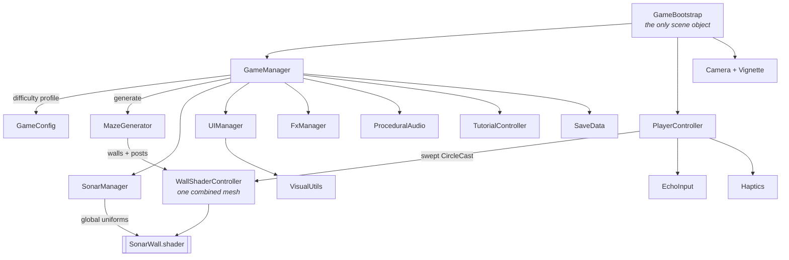

<div align="center">

# Echo Maze

### You can't see the maze. You can only listen for it.

A hyper-casual sonar puzzler for Android and iOS, where the walls are invisible until you ping them — and the light doesn't last.

by [**Vortex Forge Studios**](https://github.com/VortexForgeStudios)


[](https://unity.com/)
[](https://docs.unity3d.com/Manual/urp/urp-introduction.html)
[](#building)
[](#everything-you-see-is-code)
[](#project-layout)

</div>

---

## The idea

The screen is black. Somewhere in that black is a maze, and somewhere in the maze is an exit.

**Tap** and a sonar ring bursts out from your dot. Walls light up as the wavefront crosses them — then fade. You get a handful of reveals per level and 34 seconds. What you actually carry to the exit is a *memory* of the layout, decaying in real time.

Every ping is a trade: spend one to see, or trust what you think you remember and move.

There is no score. The only number that matters is the level you have reached, and it is waiting for you when you come back.

<div align="center">
  
  
  
</div>

---

## Everything you see is code

There are **no gameplay art or audio assets in this repository**. Not a single wall texture, particle sprite, UI icon or sound file. The only image files in the project are the two splash-screen logos.

Everything else is generated at runtime:

| What | How |
|---|---|
| Glows, rings, discs, vignette, gear, stars, UI frames | `Texture2D` written pixel by pixel in [`VisualUtils.cs`](Assets/Scripts/Utils/VisualUtils.cs), memoised so identical sprites share one instance |
| Ping, wall ticks, win arpeggio, countdown, rewind shimmer | Sine synthesis into `AudioClip.Create` in [`ProceduralAudio.cs`](Assets/Scripts/Presentation/ProceduralAudio.cs) |
| Mazes | Recursive-backtracker generator producing a perfect maze plus its solution path ([`MazeGenerator.cs`](Assets/Scripts/Gameplay/MazeGenerator.cs)) |
| Dust, bursts, wall sparks | `ParticleSystem` built from code in [`FxManager.cs`](Assets/Scripts/Presentation/FxManager.cs) |
| The entire scene | One `GameBootstrap` component on one empty GameObject — no prefabs |

The scene file contains a single object. Press Play and the game assembles itself.

---

## How the sonar works

The reveal isn't a light or a mask — it's a shader reading a global array of recent pings.

`SonarManager` keeps the last four pings and publishes them every frame as `_SonarPings`, alongside the ring speed, fade and band width. [`SonarWall.shader`](Assets/Shaders/SonarWall.shader) then computes, per pixel, how long ago the wavefront crossed *that* point and lights it accordingly, with a white flash at the front edge.

```
ringRadius = (time - pingStart) * speed
crossedAt  = (ringRadius - distanceToPixel) / speed
brightness = 1 - crossedAt / fade          // and a hot band where crossedAt ~ 0
```

Because the walls are one combined mesh at identity transform, the shader's world-space maths just works, and the whole maze is **one draw call**. Audio "ticks" and haptics are driven separately by cheap distance checks against cached wall centres — no physics queries in `Update`.

> Both custom shaders are only ever resolved by `Shader.Find` at runtime, so they must stay in **Always Included Shaders** or they get stripped from release builds and the screen renders black.

---

## Three stars, and they are lives

You start every level with three stars. Touch a decoy and you lose one, plus two seconds off the clock. Lose all three — or run the clock out — and the level restarts on a **freshly generated layout**: the same challenge, never the same solution.

Stars are not a score. They are the thing you are spending, which is what makes a decoy worth timing rather than barging through.

A **bonus echo** hidden in a dead end gives one back. It only appears on 18% of levels and only a ping can find it, so every sweep carries a small "did I hit gold?" pull.

---

## Progression

Levels are endless and the level you reach is the only thing being tracked. Quit on 24 and you resume on 24.

| Level | Grid | Reveals | Time | Decoys | Sector |
|------:|-----:|--------:|-----:|-------:|--------|
| 1 | 6×6 | 7 | 34.0s | 0 | SHALLOWS |
| 3 | 7×7 | 6 | 34.0s | 1 | SHALLOWS |
| 5 | 8×8 | 6 | 34.0s | 2 | SHALLOWS |
| 6 | 8×8 | 6 | 34.0s | 1 | THE DEEP |
| 15 | 13×13 | 9 | 33.5s | 5 | DRIFT |
| 40 | 16×16 | 11 | 35.6s | 5 | THE LATTICE |
| 80 | 16×16 | 9 | 29.5s | 5 | THE LATTICE **II** |

Reveals scale at 0.72× the grid width, so a **bigger maze means proportionally less of it you can afford to light up**.

### The sawtooth

Difficulty does not climb in a straight line. Pressure rises across a five-level sector, spikes on its finale, then drops at the start of the next one — look at levels 5 → 6 above, where the decoy count halves.

A monotone ramp reads as "the same level, slightly worse" and never lets a player feel strong. Dropping back after a peak makes the opener play as a reward — the thing that beat you last level is now easy — and makes the next climb legible as a climb. Every trough still sits above the previous trough, so the trend is up; only the shape is a sawtooth.

Sector names cycle through eight titles with a lap numeral appended, so a player 200 levels down still meets a name they have not seen. The menu names the one you are heading for and how far off it is, because *"THE HOLLOW in 3"* is a reason to keep playing and *"level 23"* is not.

Twists layer in as you climb: **decoys** from level 3, a **moving exit** that drifts between cells from level 6, and the bonus echo throughout. Each is introduced by a blocking card the first time it actually appears — playtesters met the orb with no idea what it was, and read the decoy rewind as the game malfunctioning.

---

## Architecture



`GameConfig` is a single static block holding every tuning constant in the game — maze growth, sonar timing, stars-as-lives, the difficulty sawtooth. Nothing is scattered across inspectors, and there are no ScriptableObjects to hunt through.

---

## Feel

A surprising share of the code exists purely so the game feels good in the hand:

- **Direct-drag movement.** The dot follows your finger's world delta every rendered frame — no physics step, no interpolation, no catch-up. Walls are resolved with a swept `CircleCast` and collide-and-slide.
- **Swept pickups.** A fast flick can cross a whole cell in one frame, so the exit, orb and decoy tests measure the *segment travelled*, not just where you ended up.
- **Cross-platform haptics.** `UIFeedbackGenerator` on iOS; on Android, `VibrationEffect` with two duration ladders for devices with and without amplitude control, and a busy-guard — because `vibrate()` cancels rather than queues, and firing faster than a pulse plays leaves the motor stuttering silently.
- **Every sound is synthesised, and the clear is composed.** Reaching the exit plays a C-major bloom that bends *up* into tune over 130ms — the sonar has been searching in the dark, and that is contact landing. The praise word that follows a beat later is an arpeggio over the same root, so the two read as one musical moment rather than two cues colliding.
- Hitstop, punch-zoom, screen shake, a star row that flares red when a life is spent, near-miss reveal on failure.

---

## Building

**Requirements:** Unity **6000.5.2f1**, Android Build Support (or iOS on macOS).

```bash
git clone <this-repo>
```

Open the project, load `Assets/Scenes/EchoMaze.unity`, press Play.

**Android**
- Min SDK 26, target 36, IL2CPP, ARM64, App Bundle with symbols embedded
- `android.permission.VIBRATE` is injected by [`AndroidManifestPostProcessor.cs`](Assets/Scripts/Editor/AndroidManifestPostProcessor.cs) — Unity's manifest scanner can't see JNI vibrator calls, so without it haptics fail silently
- Verify a build with `aapt dump permissions <apk>`
- Gameplay haptics are filed as **`USAGE_MEDIA`**, not `USAGE_TOUCH`. The latter is governed by the system "Touch feedback" toggle, which many people switch off — filing a game's rumble under it silently disables the entire feature on those devices. Only button taps use `USAGE_TOUCH`, where obeying that setting is correct.
- **Long-press the vibration row in Settings** to run a haptics self-test and print the platform report (SDK, activity source, vibrator source, amplitude control, attribute tier, OS setting). Haptics cannot be verified from one handset; this is how a tester reports what actually happened.

**iOS**
- The native haptics bridge lives at `Assets/Plugins/iOS/EchoMazeHaptics.mm` and is merged into the generated Xcode project automatically
- Requires iPhone 7 or newer for haptics (`UIFeedbackGenerator` no-ops on older hardware rather than failing)

> The upload keystore lives outside the repo and is gitignored. Bump `versionCode` on every upload — Play rejects a duplicate.

---

## Tuning

Open [`GameConfig.cs`](Assets/Scripts/Core/GameConfig.cs) — three knobs move the game the most:

| Constant | Effect |
|---|---|
| `FadeStart` / `FadeEnd` | How long revealed walls linger. The single biggest difficulty lever. |
| `PingBudgetScale` | Reveals as a fraction of grid width. Currently 0.72 — the scarcity that makes memory matter. |
| `SectorRelief` / `SectorFinaleBump` | Depth of the sawtooth: how far pressure drops at a sector opener and spikes on its finale. |
| `LevelTimeLimit` | Seconds per level. **Set to 0 or less to disable the fail timer entirely** — the code path exists for a relaxed mode. |
| `MoveSensitivity` | How far the dot travels per unit of finger movement. |

---

## Project layout

```
Assets/
├── Scenes/EchoMaze.unity          # one GameObject: GameBootstrap
├── Scripts/                       # 20 files, ~6.5k lines
│   ├── Core/                      # bootstrap, config, game loop, persistence
│   │   ├── GameBootstrap.cs       #   builds the entire scene at runtime
│   │   ├── GameConfig.cs          #   all tuning + the difficulty sawtooth
│   │   ├── GameManager.cs         #   level flow, stars, twists, celebration
│   │   └── SaveData.cs            #   PlayerPrefs wrapper (resume level, daily, flags)
│   ├── Gameplay/                  # the simulation
│   │   ├── MazeGenerator.cs       #   recursive backtracker + solver
│   │   ├── PlayerController.cs    #   drag movement, swept collision, rewind
│   │   ├── SonarManager.cs        #   ping state, pooled FX, tick detection
│   │   ├── WallShaderController.cs#   combined wall mesh + colliders
│   │   └── TutorialController.cs  #   blocking first-run tutorial
│   ├── Presentation/              # everything the player sees and hears
│   │   ├── UIManager.cs           #   entire HUD + menus + teach cards, built in code
│   │   ├── FxManager.cs           #   particles
│   │   ├── ProceduralAudio.cs     #   every sound in the game
│   │   ├── PulseGlow.cs           #   player halo
│   │   ├── HoldToDiagnose.cs      #   long-press hook for the haptics self-test
│   │   └── SafeArea.cs            #   notch-aware HUD
│   ├── Platform/                  # device-facing
│   │   ├── EchoInput.cs           #   input abstraction
│   │   └── Haptics.cs             #   Android + iOS haptics
│   ├── Utils/                     # pure helpers
│   │   ├── VisualUtils.cs         #   every sprite in the game
│   │   └── Easing.cs
│   └── Editor/                    # editor-only (excluded from builds)
│       └── AndroidManifestPostProcessor.cs
├── Shaders/                       # SonarWall + Additive
├── Plugins/iOS/                   # native haptics bridge (path is load-bearing)
├── Resources/Fonts/               # Orbitron + Chakra Petch (loaded by path)
├── Settings/                      # URP render pipeline assets
└── Sprites/                       # splash + studio logo (the only image assets)

docs/
├── media/                         # screenshots + the sonar GIF
└── ui-style-guide.md              # colour palette and UI conventions
```

> `Resources/`, `Plugins/iOS/` and any folder named `Editor/` are resolved by **path**, not GUID — Unity and the runtime both depend on those exact names, so they don't move.

---

## Credits

Fonts are **Orbitron** and **Chakra Petch**, both under the [SIL Open Font License 1.1](Assets/Resources/Fonts/LICENSE.txt), which permits embedding and redistribution in commercial products.

<div align="center">
<br/>

Built by [**Vortex Forge Studios**](https://github.com/VortexForgeStudios)

[](https://github.com/VortexForgeStudios)

</div>
