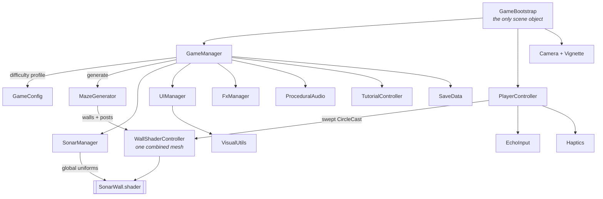

<div align="center">

# Echo Maze

### You can't see the maze. You can only listen for it.

A hyper-casual sonar puzzler for Android and iOS, where the walls are invisible until you ping them — and the light doesn't last.

by [**Vortex Forge Studios**](https://github.com/VortexForgeStudios)


[](https://unity.com/)
[](https://docs.unity3d.com/Manual/urp/urp-introduction.html)
[](#building)
[](#everything-you-see-is-code)
[](#project-layout)

</div>

---

## The idea

The screen is black. Somewhere in that black is a maze, and somewhere in the maze is an exit.

**Tap** and a sonar ring bursts out from your dot. Walls light up as the wavefront crosses them — then fade. You get a fistful of pings per level and about 45 seconds. What you actually carry to the exit is a *memory* of the layout, decaying in real time.

Every ping is a trade: spend one to see, or trust what you think you remember and move.

<div align="center">
  
  
  
</div>

---

## Everything you see is code

There are **no gameplay art or audio assets in this repository**. Not a single wall texture, particle sprite, UI icon or sound file. The only image files in the project are the two splash-screen logos.

Everything else is generated at runtime:

| What | How |
|---|---|
| Glows, rings, discs, vignette, gear, stars, UI frames | `Texture2D` written pixel by pixel in [`VisualUtils.cs`](Assets/Scripts/Utils/VisualUtils.cs), memoised so identical sprites share one instance |
| Ping, wall ticks, win arpeggio, countdown, rewind shimmer | Sine synthesis into `AudioClip.Create` in [`ProceduralAudio.cs`](Assets/Scripts/Presentation/ProceduralAudio.cs) |
| Mazes | Recursive-backtracker generator producing a perfect maze plus its solution path ([`MazeGenerator.cs`](Assets/Scripts/Gameplay/MazeGenerator.cs)) |
| Dust, bursts, wall sparks | `ParticleSystem` built from code in [`FxManager.cs`](Assets/Scripts/Presentation/FxManager.cs) |
| The entire scene | One `GameBootstrap` component on one empty GameObject — no prefabs |

The scene file contains a single object. Press Play and the game assembles itself.

---

## How the sonar works

The reveal isn't a light or a mask — it's a shader reading a global array of recent pings.

`SonarManager` keeps the last four pings and publishes them every frame as `_SonarPings`, alongside the ring speed, fade and band width. [`SonarWall.shader`](Assets/Shaders/SonarWall.shader) then computes, per pixel, how long ago the wavefront crossed *that* point and lights it accordingly, with a white flash at the front edge.

```
ringRadius = (time - pingStart) * speed
crossedAt  = (ringRadius - distanceToPixel) / speed
brightness = 1 - crossedAt / fade          // and a hot band where crossedAt ~ 0
```

Because the walls are one combined mesh at identity transform, the shader's world-space maths just works, and the whole maze is **one draw call**. Audio "ticks" and haptics are driven separately by cheap distance checks against cached wall centres — no physics queries in `Update`.

> Both custom shaders are only ever resolved by `Shader.Find` at runtime, so they must stay in **Always Included Shaders** or they get stripped from release builds and the screen renders black.

---

## Progression

Levels are endless. The hand-tuned ramp runs to level 13; past that a second "deep" ramp keeps every knob moving until it converges on a floor that stays hard but always winnable.

| Level | Grid | Pings | Time | Sector |
|------:|-----:|------:|-----:|--------|
| 1 | 6×6 | 9 | 45.0s | SHALLOWS |
| 13 | 12×12 | 12 | 45.0s | DRIFT |
| 21 | 13×13 | 13 | 46.7s | ECHO CORE |
| 45 | 16×16 | 14 | 50.2s | SHALLOWS **II** |
| 73+ | 16×16 | 12 | 42.5s | *(converged)* |

Extra grid rows *buy* seconds so a bigger maze stays fair; the deep ramp then claws them back. Sector names cycle through eight titles with a lap numeral appended, so a player 200 levels down still sees a name they haven't seen before.

Twists layer in as you climb: **decoys** that pulse in and out and rewind you if touched, a **moving exit** that drifts between cells, and a **bonus echo orb** hidden in a dead end that only a ping can find.

---

## Architecture



`GameConfig` is a single static block holding every tuning constant in the game — maze growth, sonar timing, scoring, streaks, the difficulty curve. Nothing is scattered across inspectors, and there are no ScriptableObjects to hunt through.

---

## Feel

A surprising share of the code exists purely so the game feels good in the hand:

- **Direct-drag movement.** The dot follows your finger's world delta every rendered frame — no physics step, no interpolation, no catch-up. Walls are resolved with a swept `CircleCast` and collide-and-slide.
- **Swept pickups.** A fast flick can cross a whole cell in one frame, so the exit, orb and decoy tests measure the *segment travelled*, not just where you ended up.
- **Cross-platform haptics.** `UIFeedbackGenerator` on iOS; on Android, `VibrationEffect` with two duration ladders for devices with and without amplitude control, and a busy-guard — because `vibrate()` cancels rather than queues, and firing faster than a pulse plays leaves the motor stuttering silently.
- Hitstop, punch-zoom, screen shake, rolling score, star pops, near-miss reveal on failure.

---

## Building

**Requirements:** Unity **6000.5.2f1**, Android Build Support (or iOS on macOS).

```bash
git clone <this-repo>
```

Open the project, load `Assets/Scenes/EchoMaze.unity`, press Play.

**Android**
- Min SDK 26, IL2CPP, ARM64
- `android.permission.VIBRATE` is injected by [`AndroidManifestPostProcessor.cs`](Assets/Scripts/Editor/AndroidManifestPostProcessor.cs) — Unity's manifest scanner can't see JNI vibrator calls, so without it haptics fail silently
- Verify a build with `aapt dump permissions <apk>`

**iOS**
- The native haptics bridge lives at `Assets/Plugins/iOS/EchoMazeHaptics.mm` and is merged into the generated Xcode project automatically
- Requires iPhone 7 or newer for haptics (`UIFeedbackGenerator` no-ops on older hardware rather than failing)

> Before uploading to Google Play: switch the build to **App Bundle (.aab)**, pin `targetSdkVersion`, and configure a keystore.

---

## Tuning

Open [`GameConfig.cs`](Assets/Scripts/Core/GameConfig.cs) — three knobs move the game the most:

| Constant | Effect |
|---|---|
| `FadeStart` / `FadeEnd` | How long revealed walls linger. The single biggest difficulty lever. |
| `MoveSensitivity` | How far the dot travels per unit of finger movement. |
| `LevelTimeLimit` | Seconds per level. **Set to 0 or less to disable the fail timer entirely** — the code path exists for a relaxed mode. |

---

## Project layout

```
Assets/
├── Scenes/EchoMaze.unity          # one GameObject: GameBootstrap
├── Scripts/                       # 19 files, ~5.1k lines
│   ├── Core/                      # bootstrap, config, game loop, persistence
│   │   ├── GameBootstrap.cs       #   builds the entire scene at runtime
│   │   ├── GameConfig.cs          #   all tuning + the difficulty curve
│   │   ├── GameManager.cs         #   level flow, scoring, twists, celebration
│   │   └── SaveData.cs            #   PlayerPrefs wrapper
│   ├── Gameplay/                  # the simulation
│   │   ├── MazeGenerator.cs       #   recursive backtracker + solver
│   │   ├── PlayerController.cs    #   drag movement, swept collision, rewind
│   │   ├── SonarManager.cs        #   ping state, pooled FX, tick detection
│   │   ├── WallShaderController.cs#   combined wall mesh + colliders
│   │   └── TutorialController.cs  #   blocking first-run tutorial
│   ├── Presentation/              # everything the player sees and hears
│   │   ├── UIManager.cs           #   entire HUD + menus, built in code
│   │   ├── FxManager.cs           #   particles
│   │   ├── ProceduralAudio.cs     #   every sound in the game
│   │   ├── PulseGlow.cs           #   player halo
│   │   └── SafeArea.cs            #   notch-aware HUD
│   ├── Platform/                  # device-facing
│   │   ├── EchoInput.cs           #   input abstraction
│   │   └── Haptics.cs             #   Android + iOS haptics
│   ├── Utils/                     # pure helpers
│   │   ├── VisualUtils.cs         #   every sprite in the game
│   │   └── Easing.cs
│   └── Editor/                    # editor-only (excluded from builds)
│       └── AndroidManifestPostProcessor.cs
├── Shaders/                       # SonarWall + Additive
├── Plugins/iOS/                   # native haptics bridge (path is load-bearing)
├── Resources/Fonts/               # Orbitron + Chakra Petch (loaded by path)
├── Settings/                      # URP render pipeline assets
└── Sprites/                       # splash + studio logo (the only image assets)
```

> `Resources/`, `Plugins/iOS/` and any folder named `Editor/` are resolved by **path**, not GUID — Unity and the runtime both depend on those exact names, so they don't move.

---

## Credits

Fonts are **Orbitron** and **Chakra Petch**, both under the [SIL Open Font License 1.1](Assets/Resources/Fonts/LICENSE.txt), which permits embedding and redistribution in commercial products.

<div align="center">
<br/>

Built by [**Vortex Forge Studios**](https://github.com/VortexForgeStudios)

[](https://github.com/VortexForgeStudios)

</div>
